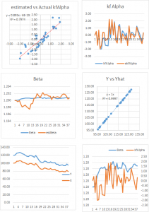

### Statistical Arbitrage Using the Kalman Filter
#### * PROBLEM: The cointegration relationship are seldom static: they change quite frequently and often break down completely.
We model the relationship between a pair of securities:  
$\beta(t)  = \beta(t-1) + w $  
the unobserved state variable follows a random walk:  
$ Y(t) = \beta(t)X(t) + v$  
where：  

$ w $~ $N(0, Q) $ meaning $w$ is gaussian noise with zero mean and variance $Q$   
$ v $~ $N(0, R) $ meaning $v$ is gaussian noise with zero mean and variance $R$   

What we are interested:
$ \alpha(t) = Y(t) – Y^*(t) = Y(t) –\ beta(t) X(t)$

As usual, we would standardize the alpha using an estimate of the alpha standard deviation, which is $\sqrt{R}$.  (Alternatively, you can estimate the standard deviation of the alpha directly, using a lookback period based on the alpha half-life).

If the standardized alpha is large enough, the model suggests that the price $Y(t)$ is quoted significantly in excess of the true value.  Hence we would short stock $Y$ and buy stock $X$.  (In this context, where $X$ and $Y$ represent raw prices, you would hold an equal and opposite number of shares in $Y$ and $X$.If $X$ and $Y$ represented returns, you would hold equal and opposite market value in each stock).

The success of such a strategy depends critically on the quality of our estimates of $\alpha$, which in turn rest on the accuracy of our estimates of $\beta$. This depends on the noisiness of the beta process, i.e. its variance, $Q$.  If the $\beta$ process is very noisy, i.e. if $Q$ is large, our estimates of alpha are going to be too noisy to be useful as the basis for a reversion strategy.

#### what would be an acceptable range for the beta process variance $Q$ ?

To get a handle on the problem, We have taken the following approach:

(i) Simulate a stock process $X(t)$ as a geometric brownian motion process with specified drift and volatility (use 0%,  5% and 10% for the annual drift, and 10%,  30% and 60% for the corresponding annual volatility).

(ii) simulate a $\beta(t)$ process as a random walk with variance $Q$ in the range from 1E-10 to 1E-1.

(iii) Generate the true price process $Y(t) = \beta(t)* X(t)$

(iv) Simulate an observed price process $Y_{obs}(t)$, by adding random noise with variance $R$ to $Y(t)$, with $R$ in the range 1E-6 to 1.0

(v) Calculate the true, known $\alpha(t) = Y(t) – Y_{obs}(t)$

(vi) Fit the Kalman Filter model to the simulated processes and estimate $\beta(t)$  and $Y_{est}(t)$. Hence produce estimates $kf_{\alpha}(t)  = Y_{obs}(t) – Y_{est}(t)$ and compare these with the known, true $\alpha(t)$.

#### The take-away is this:  the Kalman Filter approach can be applied very successfully in developing statistical arbitrage strategies, but only for processes where the noise ratio is not too large.  One suggestion is to use a filter rule to supress trade signals generated at times when the noise ratio is too large, and/or to increase allocations to pairs in which the noise ratio is relatively low.

